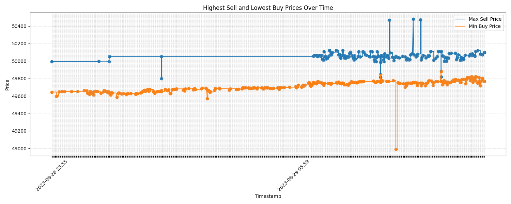

# Telegram Crypto Monitor

A Python-based system for real-time cryptocurrency monitoring, analysis, and alerting via Telegram. Utilizes webpage scraping to collect real-time data from cryptocurrency exchange platforms and uses an SQLite database to keep track of maximum sell and minimum buy prices. Offers interactive graphs and alerting capabilities.


## Features

- Real-Time Cryptocurrency Monitoring
- Data Visualization with Interactive Graphs
- Price Difference Alerts
- Scheduled Reporting via Telegram
- Easy-to-Follow Installation and Setup

## Code Overview

The `main.py` file includes code for scraping cryptocurrency data, storing it in an SQLite database, and sending alerts via Telegram. The code defines various functions:

- `send_telegram_message()`: Sends messages via Telegram
- `fetch_data()`: Scrapes data from a cryptocurrency exchange site
- `store_data()`: Stores the scraped data in an SQLite database
- `find_and_store_extreme_prices()`: Analyzes the data to find and store maximum sell and minimum buy prices
- `query_latest_data()`: Queries the most recent data from the database

## Screenshots

Price Difference Graph             |  Max-Min Graph
:-------------------------:|:-------------------------:
  |  

Telegram Group             |  Telegram Group >400
:-------------------------:|:-------------------------:
400.jpg" width="400">  |  


## Requirements

- Python 3.x
- matplotlib
- requests
- sqlite3

## Installation and Setup

1. **Clone the Repository**:

    ```bash
    git clone https://github.com/<your_username>/telegram-crypto-monitor.git
    ```
   
2. **Navigate to the Project Directory and Install the Required Packages**:

    ```bash
    pip install -r requirements.txt
    ```

## Usage

- **Monitoring Real-Time Prices**:

    ```bash
    python send_if_over_400.py
    ```
  
- **Generating Max-Min Graphs**:

    ```bash
    python Max_Min_graph.py
    ```
  
- **Generating 24-Hour Difference Graphs**:

    ```bash
    python diff_graph_past24.py
    ```
  
- **Sending Graphs via Telegram**:

    ```bash
    python send_graphs.py
    ```
  
## License

This project is licensed under the Mozilla Public License 2.0 - see the [LICENSE](LICENSE) file for details.

## Contact

For any queries, discussions, or contributions, feel free to reach out to me on Telegram: [t.me/g3ntrix](https://t.me/g3ntrix).
